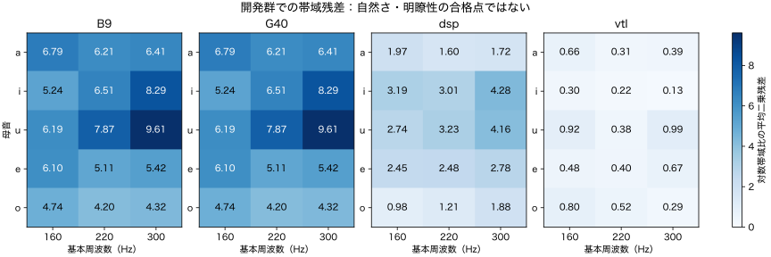

# 無人非ニューラル音声合成：実装・検証の実行報告

実施日: 2026-10-02。対象: [実装・検証計画](../plans/autonomous-non-neural-speech-plan-2026-10-02.md)。状態: **研究用実装と縮小pilotを実施。品質目標は未達（inconclusive）**。

追加検証: [評価再現性・日本語制御・VTL移出の続報](autonomous-non-neural-speech-followup-2026-10-02.md)。以下は初回3 campaignの記録。続報を含む累計は4 campaign・2,596レンダーで、品質未達の判断は継続。

## 結論と完了条件

共有規則による未知文生成、参照音声・AI評価器・ネットワークから切り離した生成、再現可能な台帳と報告を実装・検証した。一方、日本語の明瞭性には大きな誤りがあり、自然さの必須代理評価器も対象領域で資格を得ていない。計画の全体完了条件を満たしたとは扱わない。新しい試聴回答を必要とする工程は設けていない。

| 計画の完了条件 | 判定 | 証拠・範囲 |
|---|---|---|
| 未知文の生成 | 工学検査通過 | 4かな文 × 2 F0 × 2速度 × 3seed、48波形 |
| 参照・AI評価器を外した実行 | 通過 | 独立bundle、OSアクセス拒否、監査フック、通常実行とのfloat64波形hash一致 |
| 適用範囲内の必須自動ゲート | 未達 | 内容診断の誤り、E2の資格不足。最終確認用録音の音響評価は未実施 |
| 再現可能な報告 | 保存 | ソース/設定/参照/重みhash、追記台帳、失敗ログ、実行コマンド |

実装先は [`research/experiments/autonomous-speech-synthesis/`](../../research/experiments/autonomous-speech-synthesis/README.md)。旧B9/G40の認定やWebの既定音は変更していない。

## 実装と工程の到達点

| 工程 | 実施した内容 | 未達・限定事項 |
|---|---|---|
| P0 | 保存履歴の棚卸し、話者と文IDの二重分割、131課題、追記台帳 | リポジトリ外での過去の利用履歴は証明できない |
| P1 | 解析LF、帯域制限、接続、フィルタ応答、F0、破綻fixture、既存波形再現、実測費用 | 知覚代理の日本語・物理合成への転移資格なし |
| P2 | 5母音 × 160/220/300 Hz、DSP/VTLの共有係数探索と同予算無作為対照 | 全自由度での条件別自由適合は未実施。標本内の非共有設定の下限との比較のみ |
| P3 | VV、20子音系列のCV/VC、閉鎖・摩擦・破裂・鼻腔近似、連続/急変遷移比較 | 独立した高精度音素認識、音素別VOT・調音妥当性の合格判定なし |
| P4 | かな/明示音素、長音・促音・撥音・無声化・アクセント核・句内F0、16短文、韻律対照、ASR/UTMOS診断 | 辞書g2pは1文を追加検証。辞書アクセント核接続と任意漢字文の品質は未達 |
| P5 | 未知かな文、31共有係数のDSP bundle、独立プロセスとOS隔離 | 必須ゲート不足のため最終人間参照群の品質確認は未開封。VTL bundleは未移出 |

生成側は解析LFの帯域制限励起、動的フォルマント共鳴器、局所雑音、規則によるジェスチャで構成する。声門流量微分を使い、二重微分しない。出力は相対音圧であり、校正済みPaとはしない。録音素片、学習済み生成モデル、発話固有の保存制御列をbundleに含めない。

## 実験予算と追跡可能性

| campaign | 目的 | 台帳レンダー数 |
|---|---|---:|
| `ans-pilot-v1` | 母音、遷移・子音・韻律、未知入力と移出 | 2,364 |
| `ans-vtl-speech-v1` | 登録済みVTLによる短文/CVと平坦韻律対照 | 104 |
| `ans-vtl-control-v1` | VTLの低F0・速度変更による原因切り分け | 32 |
| 合計 | 3 campaign | 2,500 |

主campaignの内訳はP2が1,530、母音再確認90、P3が600、P4が96、未知入力工学検査48。P1の費用・資格用8レンダー、テスト、AI評価、隔離の再生成は別記録であり、この2,500には含めない。主campaignは保存結果を再利用して再実行し、試行数が増えないことも確認した。

P1費用を測ってP2の設定数を各backendの適応8・無作為8へ縮小した。各設定15条件×3seedで720レンダー/backend、B9/G40は合計90。選別は未使用3seedで45レンダー/backend。上限値は実施件数ではない。

**予算解釈の逸脱:** 主campaignのP3/P4は計116個の異なる課題を3規則設定で生成し、設定にある `max_p34_tasks=40` をcampaign全体の課題数制限として適用していなかった。総レンダー696は5,120以内だが、「最大40発話」の厳密な履行とはしない。VTLの追加2campaignはそれぞれ36・8課題。既存結果を後から書き換えず、この逸脱を保存する。以降のcampaignでは課題数制限を開始前に強制する実装修正が必要である。

依存キャッシュと評価用仮想環境を含む実験ディレクトリは約3.4 GiB（終了時点の概数）。初期UTMOS取得でホームのキャッシュにも約0.8 GB作成された。どちらも生成bundleの依存ではない。48時間/40GB/6campaignのサイクル上限には達していないが、評価資格不足を探索数の追加だけで解決できるとは扱わない。

## データと母音比較

JVSの開発群はjvs001/002/003/004/005/007・文001〜004、選別群は008/009/010・文005〜008、最終確認群は011/012/013・文009〜012。最終群はP0でファイルhashを記録したが、音響特徴を計算して探索へ渡していない。確認消費の記録も作成していない。

自動alignmentを±10msで摂動し、短すぎる区間やF0不確実区間を除外した。母音として残った区間は開発183、選別85。除外率はそれぞれ約80.9%、83.7%と高く、採用区間の偏りを含む。F0帯と話者を揃えて帯域エネルギーを比較したが、声道長を厳密に整合した同一声質比較ではない。

共有設定の選別残差はDSP 2.5132、VTL 0.4977。母音としての自然さや明瞭性を示す値ではない。最初の比較で旧B9/G40だけ48kHzかつWelchの窓長が同一サンプル数だったため、保存代表波形をすべて24kHz・中央280msで再測定した。再探索は行っていない。3選別話者を単位とした監査では両方式の帯域残差がG40より小さかったが、3話者の診断比較に限定する。

詳細: [共通条件の再測定](../../research/experiments/autonomous-speech-synthesis/results/ans-pilot-v1/common-measurement-audit.json)。元の測定・候補・閾値は保持した。

## 内容・自然さの診断

faster-whisper baseの日本語CPU認識を使用し、正解文を認識時に渡していない。NFKC/句読点等の除去によるCERに加え、漢字・かなの表記差を減らすOpen JTalk読み正規化後のかなCERを保存した。ASR自身の誤りを含むため、人による明瞭度とは同一視しない。自然参照3文のかなCERは10.0%。

自作DSPの16短文はかなCER 96.7%。VTLの規則韻律16短文は55.6%、平坦韻律は64.4%。自然参照と生成文は同一文集合ではなく、これらは校正・診断の記述統計である。最終品質の非劣性検定ではない。同じ先頭8文で比較すると、VTL親設定のかなCERは65.1%、F0=160Hz・速度1.0は79.1%、F0=160Hz・速度0.85は39.5%だった。低F0だけでは悪化し、速度も落とす条件で改善したが、8文の診断比較であり合格ではない。詳細は各campaignの `asr-evaluation.json` と[横断集計](../../research/experiments/autonomous-speech-synthesis/results/execution-summary.json)に記録した。

別系統の非ニューラル音素診断は、開発参照から帯域特徴の重心を作り、選別参照と生成音を分類した。選別参照での精度は35.2%、境界摂動への安定性は55.1%に留まった。生成音の誤りをすべて生成器の責任と判定できず、この診断器も合否ゲートには採用しない。音素制御ログと音響区間を照合した検査では有声母音の完全欠落は0、意図的に消した5母音fixtureは全検出。ただし子音の識別性は保証しない。

共通レベル正規化後のUTMOS中央値はDSP 0.942、VTL 1.521、各実行の自然参照は3.800と3.537だった。VTLは規則・平坦韻律の両方を含む。異なる実行間の評価器変動もあり、優劣の確定には使わない。

UTMOSv2 v1.3.0をCPUで実行し、原波形と参照・候補共通のレベル正規化を分けて保存した。自然音声、微小ずれ、半振幅、再サンプリング、clipping、dropout、同一入力再評価を含めた。VTL評価の同一自然入力再実行で最大約0.53点、5msずれで最大約0.80点変化し、dropoutで点数が上がる例もあった。これらをゼロ誤差と扱わない。日本語物理合成の人間評点との対応校正がないため、全スコアは `diagnostic-only`。MOS閾値による昇格を行っていない。

[Krugらの公式付属リポジトリ](https://github.com/TUD-STKS/TTS_Comparison_SSW21)は166音声を確認したが、取得した構成には音声と対応する個票評点ファイルがなかった。[VMC2024資料](https://github.com/sarulab-speech/VMC2024-sarulab-data)では評点とID対応を取得したものの、音声が同梱されず、[UTMOSの訓練資料](https://github.com/sarulab-speech/UTMOSv2/blob/main/docs/datasets.md)との重複もある。これらを独立した日本語物理合成の資格資料に読み替えていない。公開資料が世界に存在しないと結論しているわけではない。TTSDS2は別環境の導入・実行が未実施であり、欠損として保存した。

## 数値検査と独立生成

17テストが通過。帯域制限、LF積分とFourier係数、15母音/F0条件、seed再現性、gain線形性、閉鎖/雑音、非有限入力、欠損ゲート、確認データの開封制御、移出の不正資産検出、別プロセス一致、失敗の予算消費と中断再開を検査した。設定変更を拒否するテスト時にロックファイル解放のResourceWarningがあり、長期常駐運用では修正が必要である。数値試験の通過を音声品質の通過とはしない。

DSP bundleの未知文生成は通常の隔離プロセスでRTF 0.0347、OS制限・他評価処理の同時実行下で0.2606。比較対象のfloat64波形hashはともに `db383a06c358ef2627ccfb2ff54b73b2beced7ca7bd5cf9ff18fa0901094f9bc`。OSの参照読取り・モデル読取り・ネットワーク拒否の3probeも通過した。初回の厳格deny-default sandboxはPython起動時に失敗したため、その失敗を保持し、明示的な参照/モデル/network拒否と生成時I/O許可リストを組み合わせた第2試験を採用した。

詳細: [隔離検証v2](../../research/experiments/autonomous-speech-synthesis/results/ans-pilot-v1/os-isolation-v2.json)、[生成bundle](../../research/experiments/autonomous-speech-synthesis/results/ans-pilot-v1/bundle/synthesize.py)。入力schemaが受け付ける80〜400Hz・速度0.6〜1.6・最大30秒は検証済み全域を意味しない。実測母音格子は160/220/300Hz、未知文は180/260Hz・速度0.8/1.2である。

## 再現と残作業

コマンドと依存導入は[実験README](../../research/experiments/autonomous-speech-synthesis/README.md)に記載。既存IDはコード・設定・環境の一致を要求し、結果を上書きしない。探索コアのhashと、追加診断スクリプトのhashは別途保存する。3 campaignすべてで台帳・分割・ソース同一性・レンダー数上限の監査が通過した（前述の課題数上限の逸脱は別途記録）。[主campaign監査](../../research/experiments/autonomous-speech-synthesis/results/ans-pilot-v1/audit.json)、各campaignの `artifact-seal.json`、[17テストの記録](../../research/experiments/autonomous-speech-synthesis/results/test-results-17.log)を参照する。28 Pythonファイルの構文と文書リンク、`git diff --check` も確認した。

次段階では、課題数予算とロック解放を新versionで修正し、登録済みVTL構造で日本語の/r/・/u/・無声化・子音遷移を校正する必要がある。単純なF0/速度変更だけで子音系列の欠陥を解決したとはしない。並行して、学習資料と重複しない評点・音声の対応資料か、対象領域で独立に検証できる評価法を確保する。必須E1/E2資格と候補の条件別品質が揃うまでは、最終確認群を使って合格を作らない。

残る品質条件を削除して目標を完了扱いにはしない。今回の研究campaign終了と、ユーザーが依頼した品質目標の達成は別である。
