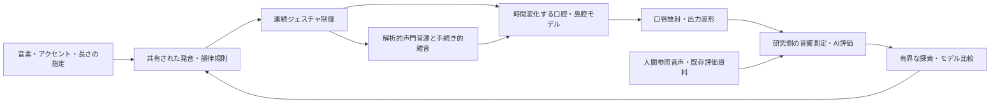

# 人の逐次試聴に依存しない、非ニューラル音声合成の再調査

調査日: 2026-10-02。状態: 文献・既存実装・保存済み結果に基づく提案。今回、新方式の合成実験や評価モデルの実行はしていない。

実行計画: [無人研究の実装・検証計画](../plans/autonomous-non-neural-speech-plan-2026-10-02.md)。

## 1. 結論

推奨するのは、**明示的な発声モデルを自動最適化し、AIを研究側の測定・評価・探索補助に使う構成**である。最終生成器は、音素・韻律指定と少数の意味のあるパラメータから、数式、フィルタ、声道計算、手続き的乱数で波形を作る。

人が毎回サンプルを聞く工程は、候補生成、選別、次実験の選択、研究版への昇格の必須条件から外す。既存の試聴回答と公開済みの人間評価付き資料を評価器の点検に使うが、新しい回答を待つ工程は設けない。

ただし、現在の研究から「無人評価に通れば人間同等の自然さを保証できる」とは言えない。目標を下げるのではなく、**高品質を追求する開発ループの自動化**と、**得られた品質について主張できる範囲**を分ける。運用上は自動検証済み研究版まで進められる。人間同等という結論を自動点数から作らない。

最初の対象は日本語の中立的な読み上げ、単一の合成話者とする。母音だけに閉じず、母音遷移、子音、語、短文までを計画に含める。表情豊かな会話、歌唱、特定話者の再現は後段とする。これは既存資産から選んだ本提案の範囲である。

## 2. 既存研究から変えるべき点

| 確認した資産・結果 | 意味 | 今回の扱い |
|---|---|---|
| [自動探索の判断](../../research/experiments/autonomous-vowel-search/results/avs-a220-search-v1/campaign-decision.md): 192音の探索と240音の頑健性検査が工学通過 | 有界実行、生成、測定、履歴保存は再利用できる。自然さの改善は未確認 | 新しい実験管理の土台に使う |
| 同実験では構造化探索と無作為探索がともに13特徴セルを被覆 | 探索方式の優位は示されていない | 高度な最適化器を先に導入せず、同予算対照を置く |
| [過去のholdout評価](../../research/experiments/comparison-evaluation/results/holdout-validation-summary.md): 自然さの予測誤差2.700、spectral-matchは参照類似性でもoriginalより低い | スペクトル距離や独自総合点の最小化だけでは目的を取り違える | 棄却済み総合点は復活させず、既知の誤判定を評価器の回帰資料にする |
| [母音ベースライン](../../research/experiments/synthetic-vowel-baseline/README.md): B9/G40は限定条件で人声判定を通過 | 有用な比較音だが、5母音・連続音声全体の品質根拠ではない | 固定アンカーとして残す |
| 同実験ではLF系、2質量、waveguideへの単純な変更は改善を示さなかった | 「物理的に詳しい」ことだけで自然さが上がるわけではない | 実装妥当性、制御、到達可能な音響の範囲を先に比較する |
| [開始部仮説の最終判断](../../research/experiments/phonation-onset-nonstationarity/results/listening/h1-final-decision.md): onset文脈の人間らしさ優位なし | onset一本で解決する根拠がない | G40を局所的な基準に残し、開始時間の細かい探索を主線にしない |
| [独立研究の実行報告](independent-voice-synthesis-execution-report.md): E0自己回復点検が不通過、公開測定への適合は未実施 | 適合失敗はモデルの表現力不足を証明しない | 終了済みE0を再開せず、必要な診断は新しい実験契約で行う |

[従来の自律研究案](autonomous-synthesis-research-approach.md)は「少数の代表を人が判断する」構成だった。今回はそこを変更し、試聴なしで研究版を更新できる別の採否契約を作る。過去の回答、凍結音声、採否を上書きする変更ではない。

### コードから見つかった具体的な診断対象

- [PythonのLF系音源](../../research/experiments/synthetic-vowel-baseline/src/synthetic_vowel_baseline/synthesis.py)は名称どおり近似であり、区間別の正規化や平均値除去を行っている。厳密LFの連続条件を検証した実装と同一ではない。
- [WebのLF音源](../../web/prototypes/waveguide-vocal-tract/src/audio/lf-source.ts)も、成長係数をゼロとし戻り相を線形化した簡易版である。コメントの「音響的に十分」は今回の品質保証の根拠にできない。
- Pythonの `saw_source()` は `scipy.signal.sawtooth` を直接標本化する。帯域制限を明示した音源と比較し、折り返し成分の影響を実測する必要がある。
- 独立研究には解析LFと流量・微分・音圧変換の検証資産がある。再利用する場合は来歴を記録し、新実験で接続を再点検する。

これらは改善仮説であり、現在の機械的な音色の原因を特定したという結論ではない。

## 3. 関連研究と採用判断

以下の「採用判断」は本リポジトリ向けの設計判断であり、文献が日本語・無人運用での成功を証明したという意味ではない。

### 3.1 VocalTractLab: 比較用の充実した物理合成器

VocalTractLab（VTL）は調音・音響・発声制御を扱う合成器で、公式配布には2025-12-05公開の2.4がある。研究用の比較バックエンドに採用する候補とする。macOSでのヘッドレス実行、APIと話者ファイルの組合せは導入時に点検する。[公式配布](https://www.vocaltractlab.de/index.php?page=vocaltractlab-download)、[公式バックエンド](https://github.com/TUD-STKS/VocalTractLabBackend-dev)

2021年のドイツ語15文・50名の比較では、VTLは非商用方式と競争力がある一方、商用方式に劣った。また、参照のF0・長さを使う再合成は自動TTSより自然さが高く、制御の重要性を示す。この成績を現在のVTLや日本語へそのまま移せないが、合成器の複雑化だけに集中しない根拠になる。VTLは「正解音」でも自然さの上限でもない。[Krug et al., 2021](https://www.isca-archive.org/ssw_2021/krug21_ssw.pdf)

VTL系では声帯の幾何学モデルの知覚的最適化も研究されている。声門音源の形状・雑音・声道との接続を調べる根拠にはなるが、同論文の人による調整工程を今回の必須工程として持ち込まない。[Birkholz et al., 2019](https://www.vocaltractlab.de/publications/birkholz-2019-interspeech.pdf)

### 3.2 VocalTrax: 最終波形を物理合成し、研究側で自動適合する実例

VocalTraxはPink Trombone系合成器への自動逆推定を扱い、JAX実装と最適化コードを公開している。未知ドメインの再合成改善と、自然な声質の再現に残る課題の両方を報告している。[著者実装・論文案内](https://github.com/PapayaResearch/vocaltrax)

ここから採るのはanalysis-by-synthesisの研究手順である。参照音声を近似する高密度なフレーム列を保存して再生する方式は、本リポジトリの最終方式にしない。自由度の高い適合はモデル診断用に隔離し、最終側には複数音声で共有できる低次元の制御規則だけを移す。

### 3.3 ジェスチャと文脈依存の微細韻律

VTLを使った微細韻律研究では、子音に関連したF0変化が特定条件で自然さを改善し得ると報告されている。ランダムな揺らぎを増やす根拠ではなく、音素イベントに結び付いた時間変化を比較する根拠とする。対象がドイツ語である点も留保する。[論文付属実装](https://github.com/TUD-STKS/Microprosody)

Articubenchは音響模倣と意味・調音の課題を分け、運動の指標も扱う。今回も、波形近似だけでなく、目標音素・タイミング・制御の成立を別々に測る。ニューラル制御モデル自体を最終生成器に採用する提案ではない。[著者ベンチマーク](https://github.com/quantling/articubench)

### 3.4 AI評価器は使う。ただし役割を限定する

| 候補 | 有用な役割 | 限界と採用条件 |
|---|---|---|
| UTMOSv2 | 文・発話の自然さ予測を追加する | 短い孤立母音、物理合成、声質範囲への妥当性は別途点検。予測値を実測MOSと呼ばない |
| TTSDS2 | 発話集合の韻律・明瞭性・表現分布を比較する | 単音の点数ではない。日本語の物理合成に対する知覚妥当性は未確認。話者一致を前提とした評価を架空の単一話者へ強制しない |
| 日本語ASR・音素認識 | 短文の文字誤り、CVの音素混同を調べる | 認識成功は自然さの証明ではない。孤立母音へ通常の文ASRを適用しない |
| SSL音声表現 | 音声集合の距離と異常領域を調べる | 話者、内容、録音条件も混ざる。距離が小さいだけで良質とはしない |
| ViSQOL等の参照付き指標 | 同じ内容・整列条件の再合成診断 | 異なる発話や話者に対する自然さ採点器として使わない |

UTMOSv2は自然さMOS予測の公開実装である。音声の一括評価は可能だが、対象領域を広げたときの性能を本リポジトリで検証する必要がある。[著者実装](https://github.com/sarulab-speech/UTMOSv2)

物理合成での誤判定は仮想的な懸念だけではない。前述の2021年の比較でもNISQA-TTSはVTL等を過大評価し、人間評価との線形相関は0.28だった。これは当該モデル・実験の結果であり、現在の全AI評価器が無効という意味ではない。[Krug et al., 2021、第3.2節](https://www.isca-archive.org/ssw_2021/krug21_ssw.pdf)

TTSDS2は多面的な分布評価と14言語のベンチマークを提案している。特に、公開v1本文では人の評価との相関検証の章は英語を対象とし、多言語対応の検証を別に扱う。「14言語対応」を「日本語の物理合成でも人の自然さ判定を代替できる」と読まない。[論文v1、第3〜5節](https://arxiv.org/html/2506.19441v1)、[公式実装](https://github.com/ttsds/ttsds)

ViSQOLの公式文書も、主用途がコーデック・通信劣化の評価であり、別用途では性能が異なると説明している。すべての候補を一つのMOSへ換算する運用は採らない。[公式説明](https://github.com/google/visqol)

実装はVERSAの必要な評価アダプタを検討する。ただし統合ツールであることと各指標の妥当性は別で、全依存を最初に導入する必要はない。[VERSA論文](https://aclanthology.org/2025.naacl-demo.19.pdf)

## 4. 推奨する生成構造

最終実行経路は上段の生成部分だけとし、参照録音、学習済み評価器、AIサービスを外しても生成できるようにする。AIが実行時に音素からフレーム単位の音響制御を作る方式も、今回は採用しない。

### 二つのバックエンドを比較する

1. **自作の軽量DSP:** 検証済み解析声門音源、帯域制限、時間変化するcascade/parallelフィルタ、必要な零点、摩擦・破裂の手続き的音源を組み合わせる。既存資産とWebへの接続を活かす。
2. **VTL等の物理バックエンド:** 声門、口腔、鼻腔、狭窄、発話ジェスチャを含む構成の比較対象とする。合成器をブラックボックスにせず、設定と版を固定する。

同じ入力契約・参照分割・予算で比較し、各段階で残す方式を選ぶ。VTLの方が良ければ、ライセンス条件を確認したうえでそのまま使う選択肢もある。自作すること自体を品質要件にしない。

### 優先する改善仮説

| 順序 | 仮説 | 反証・切替条件 |
|---|---|---|
| 1 | 音源の連続性、帯域制限、微分・放射の接続を正すと音響異常が減る | 信号異常が元からない／修正しても対象残差が減らないなら主要因としない |
| 2 | 周期に結合した気息、声門形状、低周波変動の共有制御が声質範囲を広げる | 単純な独立雑音・固定音源の同予算対照を上回らないなら拡張を保留 |
| 3 | 鼻腔分岐・閉鎖・局所雑音と連続ジェスチャが子音と遷移に必要 | 対象音素の明瞭性・遷移残差が改善しないなら制御と測定を再診断 |
| 4 | モーラ、アクセント句、無声化、促音、長音を扱う規則が短文品質を上げる | 同じ音色で規則の有無を比較し、誤り率と韻律指標が改善しないなら再設計 |

高次元のFDTD、流体計算、2質量モデルの複雑化は、低コストモデルで説明できない残差が確認できたときの局所比較に限定する。

## 5. 人の介入を不要にする評価の設計

### 評価器を先に点検する

公開済み人間評点、過去のローカル回答、自然音声の人工劣化、既知の信号異常を区別して使う。人工劣化にはclipping、DC、欠落、反復、過大変調、極端な平坦化等を含める。すべての加工が自然さを単調に下げるとは仮定せず、期待できる検出対象を指標ごとに指定する。

過去の少数回答は回帰点検には使えても、新しい知覚評価器を強く校正するには足りない。公開評点も調査ごとに尺度が違うので、そのまま混ぜず、同じ試験内の順位や対比較を使う。対象外領域の評価は `out_of_domain`、計算失敗は `unavailable` として扱う。

### 探索に使う指標と監査用指標を分ける

探索は音響・時間構造・音素制御の誤差で行い、MOS予測を直接最大化する方式から始めない。別構造の評価器と未使用データを監査側に保持する。同じ基盤モデルの別checkpointを多数使っても、独立した証拠が増えたことにはしない。

監査結果を何度も見て候補を直すと、その監査は開発情報になる。日常の回帰セット、開発内の選別セット、最後に一度だけ開く確認セットを分ける。確認後に再利用するときは履歴上で開発へ移し、新たな確認セットを用意する。

### 「高品質」を複数の条件で扱う

信号の成立、音素・文の明瞭性、声質、韻律、頑健性、生成方針への適合を別に判定する。平均点の上昇で子音の欠落や母音の取り違えを帳消しにしない。自然さの証拠が不足する場合も研究は継続するが、「自動評価では判断不能」と記録する。

試聴なしの到達点は、対象条件を明記した `autonomously-validated` 研究版とする。既存の `listener-qualified` とは別の状態であり、片方を他方へ読み替えない。

## 6. データと最終音源の境界

最初は既存JVSを中心に、通常発声と発話中の母音・子音・遷移を利用する。UTAUは単独音の補助診断に使い、録音条件に引っ張られないよう別群に置く。JVSは100話者を含み、公式サイトに音声・テキスト・タグそれぞれの利用条件が記されている。利用範囲と来歴はmanifestへ保存する。[JVS公式配布・条件](https://sites.google.com/site/shinnosuketakamichi/research-topics/jvs_corpus)

許すものは、少数のフォルマント・声道形状係数、声門パラメータ、音素別の標的、遷移時間、文脈依存の規則係数である。実測値から推定しても、音響的な意味があり、未知の文で再利用できることを求める。

録音ごとのWAV、残差、声門周期の切り出し、詳細スペクトル列、埋め込み、発話ごとの密な制御列は最終生成器へ渡さない。調音標的を補間することは録音素片の結合とは異なるが、発話を丸ごと記憶する制御辞書へ膨らませない。

参照ごとの自由適合は、モデルがどこまで近づけるかを調べる研究診断として許す。ただし有限探索の最良値を数学的な性能上限と呼ばない。その自由適合と、共有規則による未知文の合成を別集計にする。

## 7. 今回の調査で確認できたこと・未確認のこと

確認できたのは、非ニューラル合成を自動適合する公開研究、複数の自動評価手段、再利用できる本リポジトリの実験基盤、従来の評価が失敗した具体例である。

未確認なのは、新評価器が現在の合成音を正しく順位付けできるか、VTLがこの日本語課題で自作方式より良いか、共有規則でどこまで自然さを保てるか、実機での計算費である。後続計画はこの四点を最初に測り、結果に応じて自動で分岐する。
