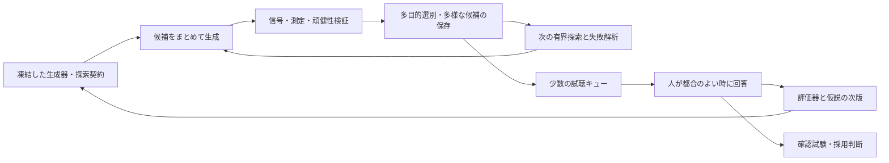

# 調査メモ: 試聴待ちで停止しない音声合成研究への転換

作成日: 2026-09-13  
状態: 調査・提案。新しい探索器や評価器は未実装・未検証。既存の試聴契約と採否は変更していない。

## 1. 提案の要点

開発の単位を「1候補を作って人に聞いてもらう」から、**「制約付き自動探索で候補群と知見を作り、少数の代表だけを人がまとめて判断する」**へ変える。

中心に据えるのは、参照音声から明示的な生成パラメータを推定する analysis-by-synthesis、複数条件での自動検証、多様な候補の保存、非同期の少数試聴である。AIエージェントは実験設計、実装、実行管理、失敗解析、次の仮説の具体化を担う。個々のパラメータ値の探索は、再現可能な最適化プログラムが担う。

人が不在でも、生成器の改善、探索空間の調査、測定誤差の解消、未試聴候補の蓄積、実装の移植まで進められる。人に委ねるのは、一定量の研究成果がまとまった時点の知覚的な方向修正と採用判断に集約する。

ただし、**自律的に研究を進められることと、人声らしさの改善を無人で保証できることは別である。** 現在の証拠から後者は保証できない。目標は、試聴の代用品を無条件に信頼することではなく、1回の試聴から得られる改善と、その間に進められる有効な仕事を増やすことである。

## 2. 現状でどこが詰まっているか

### 2.1 記録とコードから確認できたこと

- B9は `/a/`・220 Hzの研究内部基準として確定している。G40は40 msの正弦二乗gain attackを加えた開始自然さの基準である。一般利用への品質保証ではない。
- 別日反復は3回中1回のみ完了。F0、5母音、attack scalingの候補生成と信号検査、試聴準備は先行している。
- `listen-f0-generalization` → `listen-vowel-generalization` → `listen-gain-scaling` は、前工程の知覚ゲートへ直列に依存する。
- 一般化計画にはすでに「待機で止めない並行作業」がある。しかし、その主な成果は事前生成と検査であり、生成モデルの改善方向を自動探索する継続的な仕組みにはなっていない。
- 旧比較評価のholdoutでは、明瞭さは4〜5でも自然さ・声質などは1だった。スペクトルを合わせた候補は、参照類似性でもoriginalに劣った。暫定総合評価は自然さを約2.7段階過大評価し、棄却された。
- B7のF0変動は設定0.64%に対して実測約5.64%だった。補正後のB9を別途評価している。設定値を信じるだけでなく、実現信号を測ることが研究を前進させた例である。

根拠: [一般化計画](../plans/synthetic-vowel-generalization-plan.md)、[ベースライン実験README](../../research/experiments/synthetic-vowel-baseline/README.md)、[holdout検証](../../research/experiments/comparison-evaluation/results/holdout-validation-summary.md)、[現在のCLI](../../research/experiments/synthetic-vowel-baseline/src/synthetic_vowel_baseline/cli.py)。

### 2.2 解くべき問題

「良さを人にしか判断できない」だけでなく、「人の回答を次の作業全体の開始条件にしている」ことが停止の原因である。依存関係を作り替える必要がある。

また、自動点数を一つ増やしてその最大値を追うだけでは、過去のスペクトル合わせの失敗を繰り返し得る。探索が高速になるほど、評価器の弱点を大量に突く危険も増す。評価器を検証する仕事と、生成器を改善する仕事を分離する。

## 3. アプローチの比較

以下の優先度は、このリポジトリに対する提案であり、実測した優劣ではない。

| 方法 | 試聴なしで進められること | 限界 | 推奨位置 |
|---|---|---|---|
| 参照音声を使う制約付きパラメータ推定 | 多数の候補生成、音響残差の低減、説明可能な設定の獲得 | 音響的一致だけで人声性は保証できない | 主線 |
| 成分別の工学検証・頑健性探索 | 実装不良、数値破綻、seed依存、制御の不整合を除く | 安定した楽器音も合格する | 主線を支える必須基盤 |
| 多目的探索と多様性の保存 | 単一指標に偏らない候補群と適用範囲の地図を作る | 多様性も自然さではない | 主線 |
| 学習済み音声品質評価器 | 追加の特徴量と候補順位を得る | 短い孤立母音への適用性が未確認 | 評価器自身を検証してから補助利用 |
| 過去の試聴から学ぶ局所的な選好モデル | 次に聞くべき比較の選択、近傍の探索案 | 現在の回答数・条件数では汎用評価器にならない | 段階導入 |
| 微分可能DSP | 勾配による効率的なパラメータ推定 | 移植コスト、局所解、損失関数への依存 | 初期探索で計算費が問題になったら導入 |
| より詳細な物理モデル | 生成機構の欠落を調べる独立実験 | 正しい方程式でも知覚品質は自動保証されない | 残差が既存構造の限界を示す場合 |
| 音声対応AIによる評価コメント | 失敗原因の仮説や追加観察 | 評価能力・再現性を別途検証する必要がある | 任意の補助。人の回答として記録しない |

## 4. 主線: 参照音声から生成パラメータを自動で推定する

### 4.1 合成器を「調整対象」から「探索可能な関数」にする

生成器を `audio = render(model, parameters, seed, sample_rate)` として扱う。人間の録音は特徴量の測定と比較に用い、出力波形は常に生成器が作る。

最初はB9近傍の少数パラメータに限定する。例えば、スペクトル傾斜、F0変動量、振幅変動量、変動帯域、F0と振幅の相関を対象にし、F0平均と母音のformant設定は条件として固定する。探索範囲は既存測定と信号制約から新しい設定ファイルへ固定する。ここで新しい数値範囲を根拠なく確定しない。

音源と声道を同時に自由化すると、片方の誤差を他方が埋め合わせやすい。まず音源・変動を固定した声道推定、声道を固定した音源推定を行い、最後に小さい範囲で共同調整する。最適化で得た値は、音響的に有効な設定であり、人間の声帯・声道を一意に復元した値とは解釈しない。

参照ごとの高密度な制御軌道やスペクトルを出力側へ持ち込むと、プロジェクトが避けている録音依存の再構成へ近づく。初期案は、少数のスカラー、低帯域の確率過程の統計量、必要な場合の少数節点の包絡だけを成果とする。未使用seedから音を生成できることを要求する。

### 4.2 一つの「人間らしさ点数」を目的関数にしない

測定を次の役割へ分ける。

| 層 | 例 | 自動判断の意味 |
|---|---|---|
| 信号・実装制約 | clipping、DC、端点、有限値、極の安定性、実現RMS/F0 | この実験条件で壊れていない |
| 母音・制御の整合性 | F1〜F3、帯域幅、F0指定への追従 | 狙う制御に音響的に対応している |
| 音源・時間構造の診断 | 傾斜、調波構造、周期性、変動の分布・相関・時間尺度 | どの残差を減らしたか |
| 参照との距離 | 複数解像度のスペクトル距離、特徴量分布の距離 | 定義した表現上で近づいた |
| 学習済み評価器 | 校正済みの場合の予測と不確実性 | 次に調べる候補の手掛かり |
| 人の試聴 | 人声同一性、母音同一性、開始自然さ、artifact | 指定した試聴者・条件での知覚結果 |

探索器には個別の距離を与え、Pareto候補を残す。実装上スカラー損失が必要なら、目的別の重みを凍結した複数の探索を走らせる。その値を自然さの総合点として表示しない。

信号制約違反は除外するが、未校正の人間特徴量分布からの逸脱は、まず警告・探索上のペナルティとする。測定器の誤差によって有望な別方式を全滅させない。

### 4.3 平均スペクトル合わせから一歩進める

従来との差は、平均スペクトルだけでなく、**時間構造、複数の参照、生成規則の簡潔さ、条件を変えたときの頑健性**を同時に扱うことである。

- 比較前に母音、F0帯域、発声様式、録音条件、持続部の切り出し規則を分ける。異なる話者の値を無条件に一つの平均へ潰さない。
- F0・振幅の標準偏差だけでなく、自己相関や変動スペクトルも候補にする。同じ揺れ幅でも時間構造が異なる可能性を調べる。
- H1–H2などは声道の影響を受け得るため、出力音の値を声門音源そのものの正解値としない。合成器内部の真値を使う既知条件で測定誤差を調べる。
- 0.8秒だけで低周波変動の統計を精密に推定しない。測定専用の長い生成音も用い、短い試聴音と用途を分ける。人間参照が短い場合の不確実性は残す。
- 波形サンプル誤差は位相や微小時間差の影響を受けるため、異なる発声同士の主要損失にしない。
- 参照録音のノイズや部屋の応答まで再現しないよう、前処理・比較帯域を固定し、前処理版も記録する。

これらを加えると人声性が必ず上がるという証拠はまだない。自動探索が過去より説明力のある候補を作れるかを、小さな実験で判定する。

### 4.4 外部研究から得られる根拠

VocalTractLabを用いたGaoらの研究では、遺伝的アルゴリズムによる音響特徴量の最適化とパラメータ制約を組み合わせ、制約を加えた候補の参照類似性が試聴でも改善したと報告している。これは「明示的な生成器を自動最適化する」方向の根拠になるが、本リポジトリでの成功を保証するものではない。[Gao et al., 2019](https://www.isca-archive.org/interspeech_2019/gao19e_interspeech.html)

Pink Tromboneを対象としたCámaraらの研究は、参照音声へのパラメータ推定、時間方向の滑らかさ、初期値推定を組み合わせている。主観評価も実施し、ViSQOLは対象領域に合わせて校正している。ここから借りるのは、推定・生成・独立評価を分ける設計であり、論文の評価点をそのまま採用基準にすることではない。[Cámara et al., 2025](https://link.springer.com/article/10.1186/s13636-025-00414-5)

## 5. 最適化手法は軽いものから始める

初期版では、既存NumPy/SciPy生成器を再利用し、範囲を均等に覆う初期サンプルと、上位領域の局所探索を組み合わせる。乱数seed、探索境界、評価回数を固定し、単純なランダム探索を比較基準にする。

候補数を増やすだけでは不十分である。同じ評価回数で、残差、条件間の頑健性、候補の多様性がランダム探索より改善するかを調べる。探索器の選択肢としてCMA-ESやベイズ最適化を比較できるが、最初から複数のライブラリを導入する必要はない。

微分可能DSPは次段階の候補である。DDSPは、オシレーターやフィルタなどの明示的な信号処理要素を微分可能にする枠組みを示している。[Engel et al., 2020](https://arxiv.org/abs/2001.04643)

本プロジェクトで採る場合は、学習済み音声生成器ではなく、**少数パラメータのオフライン推定に微分を利用する**。最終出力は明示DSPと固定された規則だけから作る。これはDDSP全体を採用する提案ではない。

移植前に、固定seedでの勾配と有限差分の整合、フィルタ安定性、元実装との音響回帰を確認する。生成が十分安い場合は、微分対応の実装費が探索の節約を上回り得る。まず実測して判断する。

## 6. 単一の勝者を追わず、候補の地図を作る

単一の代理点数で最良の1音に絞ると、同じ欠点を持つ候補ばかり集まる可能性がある。明るさ、変動の強さ、周期性などの測定可能な軸で候補を分け、異なる領域の有望候補を残す。

MAP-Elitesは、異なる特徴領域の良い解を保存する探索方法を示している。[Mouret and Clune, 2015](https://arxiv.org/abs/1504.04909)

初期版は本格的なMAP-Elitesを実装せず、特徴量の粗い区分またはクラスタごとに、制約を満たすPareto代表を残すだけでよい。「異なる特徴領域」は知覚的な違いの仮説であり、耳で明確に違うと断定しない。

試聴キューには、代理指標で有望な候補だけでなく、別領域の代表、評価器同士が意見を異にする候補、層別に無作為抽出した候補を含める。これにより、自動選別が捨ててしまう良い音も少数ながら監査する。

## 7. 学習済み評価器は「検証する対象」でもある

### 7.1 利用可能性と適用限界

UTMOSは合成音声のMOS予測を扱い、NISQAには合成音声向けの自然さ評価用重みがある。一方、MOS-Benchは未知領域への一般化を重要な課題としている。[UTMOS](https://arxiv.org/abs/2204.02152)、[NISQA公式実装](https://github.com/gabrielmittag/NISQA)、[MOS-Bench](https://arxiv.org/abs/2411.03715)

本リポジトリの短い孤立母音、初歩的な手続き合成、人声と楽器音の境界は、これらが当該条件で有効かを別に確認する必要がある。これは対象の違いからの推論であり、これらのモデルが必ず失敗すると主張するものではない。

学習済みモデルを測定・評価に使うことは現行方針と整合する。ただし生成器から分離し、モデル・重み・前処理・入力hashを固定する。最低入力長やサンプルレートも実装時に確認する。短音を繰り返して長さを稼ぐ加工は別条件として扱い、元音と同じ評価だと見なさない。

### 7.2 導入前に既存の失敗例で試す

既存試聴付き音声から、人声不成立候補、B6、補正済みB9/B10、seed違い、onset候補などを台帳化する。すべての組合せに主観的な順位があるとは仮定せず、実際に回答された評価軸と比較だけを使う。

確認すべき点は、平均点の相関だけではない。

- 人声不成立候補を高得点にしていないか。
- 改善方向が分かっている比較を逆転させないか。
- gain、無音付加、リサンプルなどの無関係な条件に順位が支配されないか。
- 合成方式や実験セッションを外した検証でも、適用範囲が残るか。

近いseed違いや隠し重複を学習・検証へ分散すると、独立性を過大評価する。条件系列、参照元録音、セッション単位で分ける。音声が少なければ、精度を確定せず「探索的な参考値」とする。

旧holdoutはすでに結果が知られているため、失敗を再現する回帰資料には使えるが、新評価器の独立した最終試験には使えない。新しい最終判定用データを別途予約する。

### 7.3 局所的な選好モデル

汎用MOSを当てるより、「B9近傍で、どちらをこの試聴者が人声に近いと選ぶか」を学ぶ小さなモデルの方が課題を限定できる。まず少数の説明可能な特徴と正則化した対比較モデルを候補にする。

`SAME`を勝敗へ強制変換せず、同点を扱えるモデルか別ラベルを用いる。`UNSURE`を同点と同一視しない。母音同一性、人声同一性、相対的な人声らしさ、開始自然さの回答も混ぜない。

Preferential Bayesian Optimizationは、数値採点の代わりに対比較から最適化する枠組みを示している。本提案では、主に次に提示する比較の選定へ応用する。[González et al., 2017](https://arxiv.org/abs/1704.03651)

これは人の回答を不要にする技術ではない。回答を待つ間は、確定済みのモデル版で独立した候補群を探索し、回答が来たときだけ新しいモデル版を作る。不確実性の推定も校正が必要であり、モデル間の一致だけで正しさを認定しない。

## 8. 開発ループと採用ループを非同期にする

人の回答待ちは、FからGの枝にだけ存在する。開発ループ全体の必須依存にしない。試聴用に凍結した候補は変更せず、探索の継続は新しいcandidate IDとcampaign IDで行う。

### 8.1 状態を一列へ押し込まない

既存の `draft → signal-qualified → listener-qualified → release` は採用状態として維持する。その横に、探索目的で到達した事実を独立して記録する。

- `engineering_checks`: 安定性、実現値、異なる実行環境での一致など。
- `proxy_results`: 指標別の値、適用範囲、評価器version、不確実性。
- `robustness_results`: F0、母音、seed、長さ、サンプルレート別の成績。
- `listening_status`: 未提示、回答待ち、探索用回答済み、確認試験済み。

「客観測定では前進したが、知覚は未知」を正確な成果として保存できる。未試聴候補を内部実験や移植検証に使える一方、既定音への昇格には知覚的な根拠が必要となる。

### 8.2 試聴は定量的な予算を持つ

初期提案は、1 campaignにつき候補4件を基準音と比較し、隠し重複1件とアンカー1件を加える計6比較である。候補4件は、有望枠2件、別領域または評価器不一致枠1件、層別無作為枠1件とする。これは運用案であり、6比較で統計的に十分だという意味ではない。

既存ウィザードと質問軸を再利用し、所要時間を実測して負担を調整する。キューは最大1バッチに制限し、人が不在の間に数十件の試聴義務を積み上げない。未提示のキューを入れ替える場合も旧版を保存し、回答開始後は一切変更しない。

探索試聴で選んだ候補の採用には、候補・判定規則を固定した別の確認試験を使う。適応的に何度も比較した結果を、そのまま独立した効果の証明としない。

### 8.3 人が長期間不在の場合

同じ代理指標を無制限に最大化し続けない。候補生成数、CPU時間、保存容量、改善停滞の上限を設定し、上限でその探索を完了する。

回答を必要としない残りの仕事として、測定器の既知信号検証、失敗領域の整理、長時間生成、サンプルレート差、別音源の独立実験、Web DSPの内部移植検証へ進める。これらも完了したら、無目的な計算を続けず成果物を残して停止する。「試聴待ちで早期停止することの削減」と「永久に作業し続けること」は同じではない。

## 9. 現行計画からの移行

新しい研究は `research/experiments/autonomous-vowel-search/` 相当の独立実験とし、B9/G40のv1、既存回答、hash、凍結セッションを保存する。現時点でこのディレクトリは作成していない。

| 現行工程 | 新しい扱いの提案 |
|---|---|
| 別日反復3回 | B9/G40の安定性確認として継続。ただし自動探索開始の必須条件から外す |
| F0試聴合格後に他母音試聴 | 既存の凍結確認系列にはそのまま適用。新しい探索系列ではF0・母音を独立に扱えるよう別契約を作る |
| 全範囲合格後の統合 | 内部実装・回帰検証は先行。利用可能範囲は条件別の確認結果で管理する |
| 試聴のたびに候補を考える | 生成・測定・選別をcampaignとして事前定義し、少数試聴を後から取り込む |

既存の直列ロックを単に削除するのではない。研究探索と確認試験の契約を分ける。旧計画の結果へ遡って新しい合格規則を適用しない。

S系列やB4/B5の過去の不採用を無効化する必要もない。当時の条件では不採用だった事実を維持し、新方式を調べるなら、残差に対応した新仮説と別versionを用意する。

## 10. 最初の実装単位

### 段階A: 追加試聴なしで閉じる探索基盤

最初は `/a/` のB9近傍に限定する。新規の大規模学習は行わない。

1. B9/G40と関連する既存不成立候補の台帳を作る。音声・生成設定・評価軸・試聴由来を結び付ける。
2. 既存生成器をversion付きadapterから呼ぶ。測定器にもversionを付ける。
3. development参照群と候補探索範囲を固定する。最終確認用の参照やseedは探索器へ渡さない。
4. まず少数の試行で生成・測定時間を測り、実行予算を決める。
5. 例として64設定×共通3 seed＝192音を生成する。測定値と制約違反を全件保存する。
6. 最大8候補を残し、各10個の別seed×3 F0条件＝最大240音で頑健性を検査する。
7. 計最大432音に基準音・計測試行を加えた規模で、Pareto候補、失敗領域、試聴候補4件を出力する。

この数は初期の計算予算案であり、品質保証に必要なサンプル数ではない。F0拡張の検査結果も知覚合格とは扱わない。頑健性検査を見て候補を選んだ時点で、そのseed群は選別用データとなり、最終確認用としては再利用しない。

成果物は、候補manifest、個別測定、探索履歴、失敗原因、範囲別の比較表、凍結した試聴パッケージ、次の実験案とする。音が良くなったと未確認で結論せず、「どの残差を、どの条件で減らせたか」を報告する。

### 段階B: 少数試聴で探索方式そのものを評価

人が回答できる時に、凍結した6比較程度の探索バッチを実施する。改善候補が出たら新seedを使う確認試験へ進める。

評価器の選別効果も知りたい場合は、別campaignで同じ生成予算の単純探索から代表を選び、選択方式を隠して比較する。最適化を使ったこと自体を成功と見なさない。

2 campaign続けて新しい候補に知覚的な前進が見られなければ、さらに同じ探索を増やす前に、損失関数・測定・生成構造を診断する。この停止規則も提案であり、実験前に固定する。

### 段階C: 効果が見えた部分だけ拡張

F0・他母音への探索、局所選好モデル、微分可能DSP、独立した物理音源実験の順序は、段階A/Bの残差と計算費から決める。学習済み評価器の校正が失敗しても、Aの探索・工学検証は継続できる構造にする。

## 11. 成功を何で測るか

| 指標 | 測る理由 |
|---|---|
| 人の回答待ちなしで完了できた実験単位数 | 自律性の改善を直接測る |
| 試聴1分あたりの確認済み改善候補数 | 人の負担に対する実効的な品質改善 |
| 独立確認で基準より改善／非劣化／悪化した割合 | 代理点数の上昇を品質改善と取り違えない |
| 自動選別上位の人声不成立率と、無作為枠の取りこぼし | 評価器の誤りと選別バイアスを測る |
| seed・F0・母音条件ごとの失敗率 | 特定の1音への過適合を検出する |
| 同じ計算予算で得られる候補の多様性と残差改善 | 探索器の費用対効果を測る |
| 再生成可能率、測定失敗率、実行時間 | 基盤の信頼性と運用費を測る |

現時点では「試聴が何割減る」「何日で自然になる」という数値は出せない。まず自動探索1 campaignを人の介入なしで閉じられることを工学上の達成点とし、品質上の達成点は後続の凍結確認試験で判定する。

## 12. 調査時点の判断

最も適した転換は、**制約付きanalysis-by-synthesisを主線にして、工学検証と多様な候補の蓄積を自律化し、人の試聴を非同期の少数判断へ集約すること**である。

既存資産には、再現可能な生成器、測定基盤、失敗例、B9/G40基準、匿名試聴ウィザードがある。必要なのはそれらを一つの停止しない探索系へ接続することであり、最初から新しい巨大モデルを作ることではない。

このメモの提案はまだ検証前である。既存契約を変更したり、試聴を開始したり、評価モデルをダウンロードしたりはしていない。次の実装候補は、段階Aの小さな自動探索実験である。

## 13. 追加メモの評価を受けた補強

同日、[音声評価・最適化メモ](speech-synthesis-evaluation-and-optimization.md.md)を評価した。詳しい採否と引用確認は[評価メモ](speech-synthesis-evaluation-and-optimization-review.md)に記録した。

段階Aには次の3点を取り込む。

1. 音響目標を、出典・適用条件・単位・推定器version・不確実性付きの仕様として保存する。探索制約と診断値を区別する。
2. 既存の比較評価コードを再利用し、小さな固定回帰セットの変更前後レポートを出す。未対応条件・推定不能を成功に混ぜない。固定セットは独立holdoutとは扱わない。
3. パラメータ感度と生成器の到達範囲を測定し、探索不足と生成構造の限界を切り分ける。

ASR・音素認識・forced alignmentは、対象音声での校正後に追加する任意の診断とする。母音分布への適合、ASRの正答、alignmentの成功は、人声同一性や自然さの合格へ直結させない。現行母音研究の自動探索を、これらの新規導入待ちで止めない。
