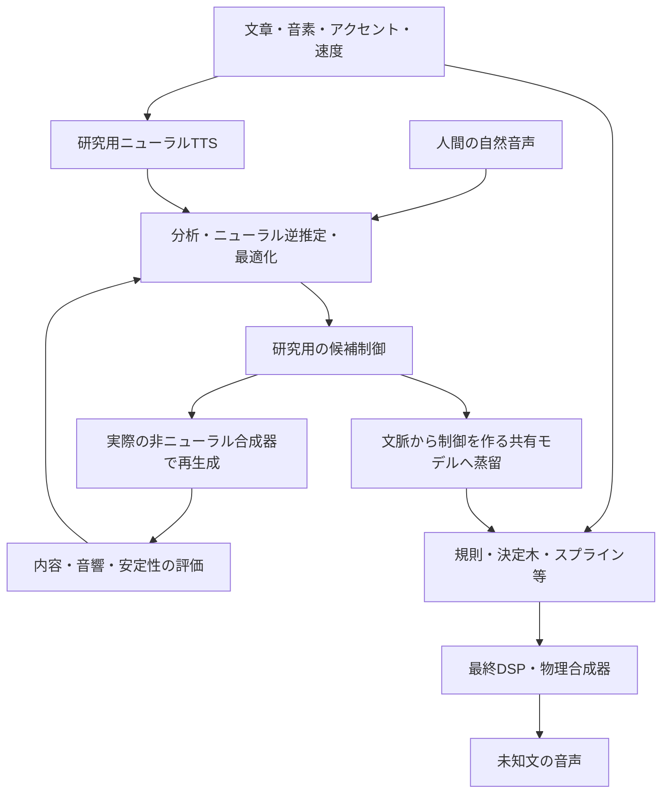

# ニューラルを研究に使い、非ニューラルへ移す音声合成研究

作成日: 2026-10-02。策定時点では実験案。その後、実施指示に基づき1 campaignのpilotを実行した。[実施結果と未達条件](../note/neural-assisted-non-neural-speech-pilot-result-2026-10-02.md)を参照。計画の品質条件は変更していない。

ユーザーの方針: **無人で研究・実験を進める。研究中はニューラル生成も利用し、最終的には非ニューラルへ落とし込む。** 旧サイクルの結果・認定・最終確認集合は保持する。本書は[旧計画](autonomous-non-neural-speech-plan-2026-10-02.md)の完了認定ではなく、次の研究設計である。

## 1. 推奨する主線

**ニューラルで有効な音と制御を見つけ、非ニューラルの合成器で再現し、その制御を未知文にも使える小さな共有モデルへ移す。** これを段階ごとに検証する。

優先するのは、巨大な音声生成ネットワーク全体を一度に数式化する方法ではなく、次の経路である。

1. ニューラルTTSと自然音声を、内容・タイミング・音源特性を調べる研究用の目標にする。
2. 学習した逆推定器や代理モデルを使い、DSP/VTLでその目標に近づく制御を探索する。
3. 得られた制御を、音素文脈・アクセント・発話速度から生成できる決定木、スプライン、加法モデル、簡潔な数式へ近似する。
4. ニューラル部分を外した最終経路で、未知文・未知文脈を再生成して比較する。

研究中に使うニューラル生成器や制御器は、有用な中間成果として保存する。その性能を最終非ニューラル版の性能と混ぜない。最終除去に失敗した場合も、どの部分で性能が落ちたかを次の実験へつなげる。

## 2. これまでの研究から変える点

[追加サイクル結果](../note/autonomous-non-neural-speech-extension-progress-2026-10-02.md)と、その機械可読の[終了判断](../../research/experiments/autonomous-speech-synthesis/results/cycles/ans-extension-20261002-v1/decision.json)を再確認した。

|観測した事実|新しい研究での扱い|
|---|---|
|静的自由適合は選別残差を14条件中13条件で減らしたが、自然さの改善は未確認|母音スペクトルの微調整だけを主線にせず、動的な制御と内容保持を比較する|
|14条件中10条件が利得上端付近。現行5変数化は旧利得領域の一部を除外|境界修正は必要だが、これだけで解決すると仮定しない。適合不能と探索制約を分離する|
|舌尖の幾何閉鎖は成立しても、接触時刻変更はかなCERの保護条件を通らない|指令パラメータではなく、実際の閉鎖・開放・有声化・母音遷移を連動して学習・比較する|
|日本語の公開評点資料を入手しても、物理合成に対する知覚資格には届かない|評価研究を独立の作業系統にし、診断による改善と自然さの最終認定を別々に記録する|
|1,780レンダーのtrial内処理は約23秒だが、管理を含む実時間は約65.7分|次版では管理処理を計測して削減し、実験数を増やす前に実験一巡の時間を改善する|
|現行confirmは工学確認までで品質認定経路が未実装|新しい評価契約に対応する判定器を別版で実装する。CLI入口の存在を完了扱いしない|

以上から、停滞を「物理モデルの限界」と決めつける根拠はない。生成器の表現、制御、最適化、評価、実験管理を分けて調べる。

## 3. 参考になる一次資料と、使える範囲

### ニューラル制御で物理合成を改善する

**TensorTract3（ESSV 2026）** は音声からVTL制御を推定し、学習した音響モデルを通す損失を使用する。英独の試験ではVTL出力のCER改善を報告している。音声入力と抽出F0を使う再合成であり、ニューラルなしのテキスト読み上げを完成させた研究ではない。長い学習で代理モデルの誤差を利用し、実VTL出力が悪化する問題も記載されている。合成学習資料は約430時間で、本研究の小規模pilotへそのまま移植できる費用ではない。[論文・手法と限界](https://www.essv.de/pdf/2026_112_119.pdf)、[著者の比較音声ページ](https://tensortract3.github.io/)

ここから採る設計上の示唆は「制御変数の一致だけでなく、実際の音響出力で制御を学習すること」。日本語への転用と小規模化は本プロジェクトでの未検証仮説である。利用可能なコード・重み・依存条件は、導入前の調査項目として残す。

**VocalTrax（2024）** はJAXによる調音モデルの自動逆推定を公開している。音響目標から物理合成器の到達可能な応答を調べる実装候補になるが、自然な声質の再現には課題が残る。高密度な推定軌跡をそのまま最終資産へ持ち込むことは、共有制御への移行とは別である。[著者実装](https://github.com/PapayaResearch/vocaltrax)

### 学習時だけニューラルを使う構造を作る

**DDSP調音ボコーダ（Liu et al., 2024）** は調音特徴・F0等と調波・雑音合成を組み合わせる。研究中の構成要素の切り分けに向くが、制御ネットワークを残す限り最終非ニューラル版ではない。報告はMNGU0/LJ Speech上の結果であり、日本語への成功やニューラル除去後の品質を示さない。[論文](https://arxiv.org/html/2409.02451v1)

日本語資料を利用した**DNNパラメータ推定＋微分可能音声合成器**の公開実装もある。逆推定の実装参考になる一方、推定した高密度スペクトルからの再合成を、未知文生成と同一視しない。[著者実装](https://github.com/ndkgit339/spe-dss)

### 学習した関数を非ニューラルへ近似する

**SymTorch（2026）** はニューラル成分の入出力を集め、PySRで数式へ近似・置換する仕組みを提案する。関数の複雑さと近似誤差の交換関係があり、音声合成全体の蒸留成功を示す論文ではない。本研究では、閉鎖時間、調音標的、F0補正などの低次元な部分関数への応用を検討する。[論文](https://arxiv.org/html/2602.21307v1)

**HTSのHMM系制御とWORLD** は、非ニューラルな統計的制御・分析再合成の比較候補になる。HTSにはDNNを使う構成もあるため、比較時は構成を明示する。WORLDはF0・スペクトル包絡・非周期性からの再合成器であり、単体ではテキストからの制御生成を解決しない。[HTS公式](https://hts.sp.nitech.ac.jp/)、[WORLD公式実装](https://github.com/mmorise/World)

研究用の日本語ニューラル教師には、たとえばCPU推論経路を持つStyle-Bert-VITS2を候補にできる。今回は特定の声・重みを採択していない。コードと音声モデルの条件を別々に点検し、品質・実行費・由来が確認できたものを固定する。[公式実装](https://github.com/litagin02/Style-Bert-VITS2)

## 4. 比較するアプローチ

以下の優先順位は本リポジトリ向けの設計判断であり、文献の性能順位ではない。

|経路|ニューラルを使う部分|最終的に残すもの|確かめる問い|優先度|
|---|---|---|---|---|
|教師音声→非ニューラル再合成|日本語TTS、分析・逆推定|まず研究用のDSP/VTL/WORLD出力|良い目標を与えれば、どこまで内容・動きを保てるか|最初|
|学習した制御→共有規則|調音逆推定、文脈からの制御予測|文脈依存の決定木・スプライン＋物理合成器|有効な制御を、参照音声なしで再現できるか|主線|
|微分可能DSP→制御関数の蒸留|DSP制御器、学習用損失|手続き的調波・雑音・フィルタと小さい関数|自作DSPの不足は波形モデルか制御か|比較線|
|ニューラル残差→明示的な補正|研究用の残差生成器|追加の極・零点、声門非対称、非周期性、文脈時間則など|ニューラルが補う成分を少数の機構で説明できるか|上記が詰まった場合|
|統計的制御を直接学ぶ|教師音声の生成・ラベル候補|回帰・HMM・小さい決定木による低次元制御|複雑な教師制御器を作らず、教師データだけで前進できるか|低費用の必須対照|
|大きいニューラルボコーダ全体の数式化|音声生成ネットワーク全体|多数の数式になる可能性|制御可能性と品質を保った圧縮が現実的か|初期主線にしない|

ニューラルを経由する方式には、同じ資料・同じ実生成予算で「直接非ニューラルモデルを学習する方式」を必ず置く。ニューラルを使ったこと自体を改善の証拠にしない。

## 5. 蒸留先を先に設計する

### 入力と出力

最終制御器の入力は、音素、前後の音素特徴、モーラ位置、アクセント、句位置、指定F0・速度・声質とする。教師音声、SSL特徴、話者埋め込み、発話IDを実行時入力に含めない。

出力は、調音標的、開始/終了、閉鎖・開放の時刻、声門・気息・鼻腔結合、F0と強度の低次元係数など。フレーム列は実行時にこれらから生成する。

最初は「音素ごとの共有標的＋少数の文脈補正＋滑らかな遷移」で始める。たとえば閉鎖時間を音素別基準、発話速度、隣接母音、句位置の加法モデルで表し、調音軌跡を少数の節点から補間する。音素別モデルと局所文脈モデルの複雑さ上限を先に固定する。

### 推奨する置換順序

1. F0・継続長・有声/無声イベント。
2. 母音の調音標的とVV/CV遷移。
3. 閉鎖・破裂・摩擦・鼻腔結合の相対タイミング。
4. 声質と小さい文脈依存補正。

決定木や加法モデルで十分なら、それを使う。単純な形で残差が系統的に残る部分だけ数式探索を試す。ニューラルモデル全体を一括変換することを前提にしない。

### 波形を通して検証する

調音の逆問題には多義性があるため、教師パラメータの二乗誤差だけで学生を採択しない。異なる制御が同程度の音を作る場合もある。学生を実合成器で動かし、内容、時間構造、音響、安定性を測る。

学習時には概念的に、`音響損失 + 内容保持 + 制御の滑らかさ + 生理/数値制約 + モデル複雑さ` を扱う。単位・尺度を揃えて開発群で重みを固定する。探索の目的に用いた学習型特徴とは別に、監査用の指標を残す。

最終成果物は、音素・韻律から生成できる固定サイズの共有モデルと非ニューラルレンダラーに限定する。発話ごとのWAV、スペクトル列、制御軌跡の検索・再生へ置き換えない。ネットワークの重みをCコードへ変換しただけのものは、この研究の「ニューラル除去」には数えない。

## 6. 最初に行う比較実験

### A. 制御と生成器を切り分ける

同じ内容について次を保存し、音声源・与えた情報を明記して比較する。

|条件|使用できる情報|役割|
|---|---|---|
|自然参照|録音|内容・測定器の参照|
|ニューラル教師|文章、教師モデルの設定|良好な発音・韻律の比較候補。人間評点の正解ラベルにはしない|
|現行の共有規則＋DSP/VTL|文章/音素だけ|基準|
|参照に合わせた制御＋DSP/VTL|研究中のみ目標音声を使用|制御を自由にした場合の観測上の到達点|
|同じ制御＋ニューラル側の生成器|研究中のみ|実装可能な場合の、生成機構の差の診断|
|蒸留した共有規則＋同じDSP/VTL|文章/音素だけ|最終方式へ移せた改善|

WORLDでの分析再合成を補助対照に置くと、現行3共鳴器/VTLの問題と、より一般的な信号処理による再合成の問題を分けやすい。WORLD再合成の成功だけで、未知文合成や最終移出を合格にはしない。

「参照に合わせた制御」の成績は探索・予算に依存する観測値であり、モデルの数学的な上限とは呼ばない。F0・長さを参照から与えた条件と、自前で予測した条件も分ける。

### B. 最小の蒸留比較

最初から長文全体を学習しない。5母音だけで終えず、母音遷移、破裂・摩擦・鼻音を含む短い発話から始める。過去に細かく調整した/r/だけへ集中しない。

同じ訓練資料で、(1)現在の手書き規則、(2)直接学習した非ニューラル制御、(3)研究用ニューラル制御、(4)そこから蒸留した非ニューラル制御を比較する。レンダラーを固定し、制御の違いを測る。レンダラー自体を拡張する場合は別の比較に分離する。

文章・語彙・音素文脈・F0/速度の組合せを分け、同じ音の別seedを独立した発話数に数えない。教師が1つだけなら、教師の癖を模倣している可能性を自然参照や別教師で点検する。

### C. 自動で選ぶ次の処理

|観測|次の処理|
|---|---|
|良い教師でも研究用再合成が悪い|適合器の自己回復・多義性・探索領域を先に点検。複数の推定法でも残る残差に対応した機構拡張を比較|
|実DSP/VTLの再合成は良いが、文章入力の制御で悪い|文脈、継続長、共調音のモデルを改善|
|ニューラル制御では良く、学生で悪い|学生の状態・文脈・時間表現を一段だけ拡張。複雑さと改善を比較|
|代理モデル上だけ良い|実レンダラーの再評価を増やし、代理を修正。実音で確認できない候補を採択しない|
|直接非ニューラル学習と同程度|費用・複雑さの小さい経路を残す|
|内容は改善するが自然さの証拠が不足|内容改善として研究版を保持し、知覚的な品質主張は保留。次の音響・制御実験は継続可能|
|規定の比較を使い切る|結果・失敗理由・再開点を保存。終わりのない探索へ自動延長しない|

## 7. 評価を研究の停止要因にしない運用

自然さの最終認定と、個々の実験から次を選ぶ判断を分離する。これは元の品質目標を下げる変更ではない。

- **工学:** E0、制御範囲、再実行、実時間、メモリ、最終依存の検査。
- **内容:** 自然参照・教師にも同じASRと正規化を適用。探索に使わない別の認識器・方式で監査する。系列別・文脈別・速度別の悪化を残す。複数モデルの訓練・基盤が共通なら独立な証拠数を水増ししない。
- **制御と音響:** F0、有声/無声、継続長、VOT、遷移、帯域雑音、複数時間解像度のスペクトル。整列を必要とする距離は再合成条件に限定する。
- **蒸留:** ニューラル制御と学生の両方を同じ実レンダラーで比較し、移行時の損失を測る。直接非ニューラル学習との比較も必須。
- **知覚:** 公開評点で確認できた適用範囲のみ合否に利用する。未資格のUTMOSや学習時の判別器は補助診断。教師の高スコアを自然さの正解ラベルとして使わない。

主要指標、非劣性幅、保護条件、多重性、欠損の扱いは、評価器の再現性と開発資料から定め、選別前に固定する。根拠が不足する指標は診断のままにする。新しい試聴回答を実験開始や次の分岐の条件にはしない。

最終P5の判定器は別版で、資格不足、欠損、保護条件悪化、確認集合再利用を拒否する経路と、正当な独立証拠から合格へ進む経路の両方を実装・検査する。人工fixtureによる判定器テストを、実音声の品質証明として数えない。

## 8. 無人実行と費用の設計

最初の実行案は、**1つの小規模pilotで経路の成立を調べる**ものとする。比較対象はDSPとVTLのうち1つを主にし、もう1つは限られた対照とする。TT3の大規模学習の再現を最初の作業にしない。

予算案は1 campaign、最大4時間・追加3GB、教師音声最大48件、物理/DSPレンダー最大2,000回、AI評価最大300回。数値は費用上限の提案であり、品質達成の予測ではない。自己回復、候補の途中評価、失敗、再試行、蒸留後の再生成も枠内に計数する。最初の費用点検から全体の割当を固定し、教師/学習が重ければ件数を事前に縮小する。

24件程度の短発話を使う場合も、文・文脈で開発/選別/監査を分ける。この件数は経路の原理検証用であり、広い日本語品質や統計的検出力を保証する規模ではない。未使用の旧最終確認群はpilotに使わない。確認資料の不足は報告する。

教師モデルの導入では、コード・重み・声・出力利用の条件、ローカル実行可否、実行費を先に確認する。取得できない候補は `unavailable` として残し、取得済みの自然参照や軽量な比較へ分岐する。外部への連絡、有料API、無制限のダウンロードを前提にしない。

実験管理は次版で見直す。各レンダーで全ディレクトリを走査する方式を、予約台帳と管理対象の書込計数、定期照合、容量余裕を組み合わせる方式と比較する。外部書込や上限超過を見逃さないことを検証してから採用する。管理時間、学習時間、実レンダー時間、評価時間を別々に残す。

なお、旧追加サイクルの3枠は使用済みであり、この案を旧IDの再開として実行しない。策定時点では実行を開始していなかった。その後の実施指示に基づき、新ID `nas-pilot-20261002-v1` で上記上限内の比較を実施した。

## 9. 残す成果物と判断

次のpilotでは、教師の来歴、分割、低次元制御schema、直接学習対照、研究用ニューラル制御、蒸留した制御、実レンダラーによる比較、失敗例、時間/容量台帳を残す。

最終bundleの検査では、ニューラル重み・推論エンジン・教師音声・参照音声・ネットワークへのアクセスを外し、未知入力を生成する。保存モデル量が訓練発話数に比例して増えていないこと、入力からフレーム制御を計算すること、コード化したネットワークを隠していないことを確認する。

まず得たい結論は「ニューラルを使うと高得点になった」ではなく、**非ニューラルの実音声へ移せた改善があるか、移せないならどの段階で失われるか**である。この結論に基づき、制御モデル・合成機構・蒸留表現のうち次に変えるものを選ぶ。
